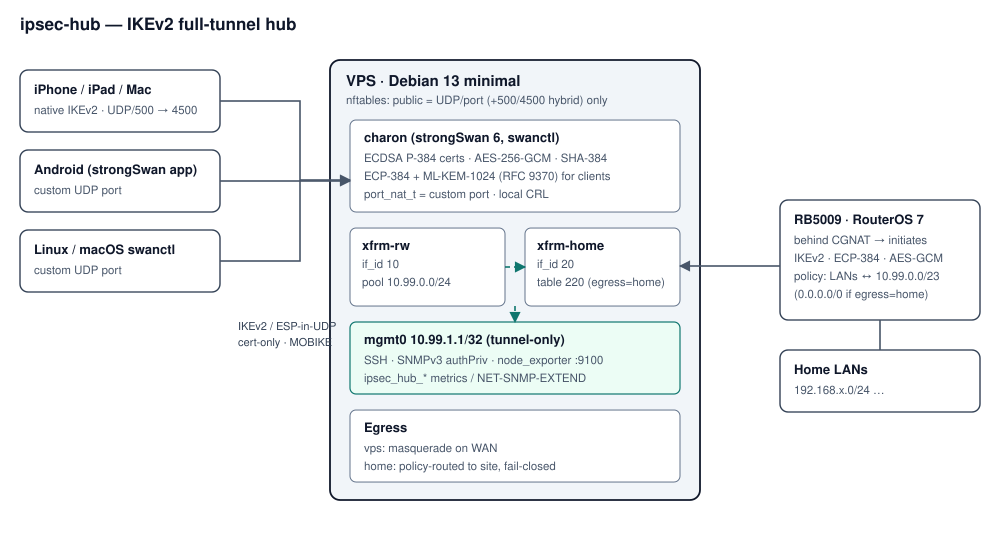

# qikehub

Interactive installer that turns a small KVM VPS into an IKEv2/IPsec **full-tunnel hub**: phones and laptops connect to the VPS, a home router behind CGNAT connects outbound to the same VPS, and client traffic egresses either at the VPS or through home. Management (SSH, SNMPv3, Prometheus) is reachable **only through the tunnel**.



## Design in one screen

| Area | Choice |
|---|---|
| OS | Debian 13 minimal (strongSwan 6.0.x, nftables, kernel 6.12). Ubuntu 24.04 works without ML-KEM. |
| IKE daemon | `charon-systemd` + `swanctl`, route-based via **XFRM interfaces** (`if_id`), no updown scripts |
| Auth | Certificates only. Private CA, ECDSA P-384 / SHA-384, per-device identity `name@<fqdn>`, CRL revocation |
| Client crypto | IKE `aes256gcm16-prfsha384-ecp384-ke1_mlkem1024`, ESP `aes256gcm16-ecp384-ke1_mlkem1024` (PFS on rekey) |
| Site crypto | ECP-384 + AES-256-GCM, with AES-256-CBC/SHA-384 accepted for RouterOS IKE (no GCM there) |
| Public surface | One UDP port (optionally + 500/4500 for Apple native). Everything else dropped. |
| Management | `mgmt0` dummy `/32` inside the overlay; nftables permits 22/161/9100 only from `xfrm-rw`/`xfrm-home` |
| Egress | `vps` (masquerade) or `home` (policy routing to the site SA — fail-closed, never leaks via VPS) |
| IPv6 | Always captured (`::/0` + ULA pool) → rejected (default) or NAT66 via VPS. No leaks either way. |

## ⚠ Non-standard port vs Apple clients

Apple's IKEv2 configuration profile schema has **no remote-port key**; the native client always opens on UDP/500 and floats to 4500. So:

| Client | `PORT_MODE=custom` (one UDP port) | `PORT_MODE=hybrid` (+500/4500) |
|---|---|---|
| iPhone / iPad (native) | ✗ | ✓ |
| macOS (native profile) | ✗ | ✓ |
| macOS strongSwan via Homebrew (`swanctl`, `remote_port`) | ✓ | ✓ |
| Android strongSwan app (`.sswan`, has a port field) | ✓ | ✓ |
| Linux strongSwan | ✓ | ✓ |
| RouterOS 7 site (`peer port=`) | verify (see below) | ✓ |

The port is not the security boundary — certificate-only IKEv2 with strict proposals is. The custom port removes scanner noise. In `hybrid`, charon keeps UDP/500 and the published port is its NAT-T socket; nftables redirects inbound 4500 to it, so no daemon listens on 4500.

## Requirements

- KVM/Xen VPS (not OpenVZ/LXC — needs XFRM + xfrm interfaces). 1 vCPU / 512 MB is plenty.
- Debian 13 minimal, root, an SSH key already installed.
- DNS A record `vpn.example.com → VPS IPv4`.
- Provider firewall: UDP/`<port>` (+ UDP/500, UDP/4500 in hybrid) and TCP/22 from your IP until `lockdown`.

## Quick start

```bash
git clone https://github.com/LucaBiancorosso/qikehub && cd qikehub
sudo ./qikehub install          # interactive; installs itself to /opt/qikehub
sudo qikehub add-client luca-iphone
sudo qikehub add-client luca-mac
sudo qikehub site-config        # RouterOS script + site identity
# connect a client, then over the tunnel:
ssh root@10.99.1.1
sudo qikehub lockdown           # closes public SSH
```

Firewall changes made over SSH are applied with a 60-second confirm-or-rollback: open a **new** SSH session, then type `ok`.

On a brand-new install, public SSH stays reachable (from your detected client IP if you connected over SSH, otherwise from anywhere — e.g. installing from a provider's web console) until you run `lockdown`. Re-running `configure` later never reopens it on its own.

Progress messages (`[+] ...`) are off by default — prompts, warnings and errors always show. Set `HUB_VERBOSE=1` for per-step confirmations.

Non-interactive: export any key from `examples/hub.env.example` and run with `HUB_NONINTERACTIVE=1`.

## Commands

| Command | Purpose |
|---|---|
| `install` / `configure` | Wizard; re-run to change settings (current values become defaults) |
| `render` | Re-apply sysctl, interfaces, strongSwan, nftables, monitoring from `/etc/qikehub/hub.conf` |
| `add-client NAME` | Issue identity; writes `.mobileconfig`, `.sswan`, `swanctl.conf`, `.p12` to `/var/lib/qikehub/out/NAME/` |
| `revoke-client NAME` | CRL update, reload, terminate live SAs of that identity |
| `list-clients` | Issued identities and status |
| `site-config` | (Re)issue site identity (old one revoked) + RouterOS `.rsc` |
| `status` | Services, tunnel metrics, SAs, config summary |
| `lockdown [--force]` | Remove public SSH; refuses unless your session arrives on the mgmt IP |
| `allow-ssh CIDR[,CIDR]` | Temporarily re-open public SSH |
| `snmp-rotate` | New SNMPv3 credentials |

## Client onboarding

**iPhone / iPad / Mac (native):** AirDrop or serve the `.mobileconfig`, install, enter the PKCS#12 password shown once by `add-client`. With `APPLE_ONDEMAND=yes` the profile sets `OnDemandEnabled` + `IncludeAllNetworks` + `ExcludeLocalNetworks`: always-on and fail-closed (no connectivity if the hub is down). `EnforceStrictAlgorithmSelection=1`. PQ key exchange (`PostQuantumKeyExchangeMethods = [37]` = ML-KEM-1024) needs iOS/macOS 26; with `PQ_MODE=require` older OS versions will not connect — use `prefer`.

**Android:** import the `.sswan` in the strongSwan app (port pre-filled), enter the PKCS#12 password.

**macOS/Linux strongSwan:** follow the header of `NAME-swanctl.conf`.

PKCS#12 files use PBE-SHA1-3DES + SHA-1 MAC because that is what Apple imports reliably. That wrapping only protects the file in transit; it is keyed from a random 24-character password. Device private keys are shredded on the hub after export — lost profile means reissue.

## Security notes

- **Identity separation:** clients match `*@<id-domain>` on connection `rw`; the site must present exactly `fqdn:<site>.sites.<id-domain>` on connection `home`. A client certificate cannot land on the site connection or vice versa.
- **DoS:** `cookie_threshold=5`, `block_threshold=3`, `init_limit_half_open=200`; nftables rate-limits new IKE flows.
- **CA on the hub:** convenient (issue/revoke from the box). For a stricter posture, move `pki/private/ca.key` offline after issuing and bring it back only to issue or revoke.
- **Revocation:** local CRL (10-year validity, re-signed on every change) loaded into charon; revoking also tears down live SAs.
- **Host:** key-only sshd drop-in, unattended security upgrades, loose RPF (required for home egress), redirects/source-route off.
- **State & secrets:** `/etc/qikehub` (0700). Nothing secret lives in the repo; `.gitignore` blocks common artefacts.

## Monitoring

Collector timer (30 s) → `/run/qikehub/snmp/*` and `/var/lib/prometheus/node-exporter/qikehub.prom`.

```bash
# Prometheus
curl -s http://10.99.1.1:9100/metrics | grep ^qikehub

# SNMPv3 (credentials: /etc/qikehub/secrets/snmp.env)
snmpwalk -v3 -l authPriv -u monitor -a SHA-256 -A "$AUTH" -x AES -X "$PRIV" \
  10.99.1.1 NET-SNMP-EXTEND-MIB::nsExtendOutput1Line
```

Keys: `charon_up home_up rw_ike_sas rw_child_sas home_ike_sas home_child_sas rw_bytes_in rw_bytes_out home_bytes_in home_bytes_out pool4_online server_cert_days` (SNMP extend names are `qikehub_<key>`). The collector parses `swanctl --list-sas` text output; if a future strongSwan changes that format, switch it to VICI (`python3-vici`).

## Home site (RouterOS 7)

The generated `.rsc` creates profile/proposal/peer/identity/policies, puts IPsec flows ahead of fasttrack, and exempts traffic to the overlay from srcnat. With `EGRESS=home` it adds client masquerade and DNS on the router. LANs inside VRFs need route leaking to the overlay: RouterOS IPsec policies operate in the main table.

### RouterOS on a custom port

strongSwan (≥ 6.0.1) initiators send IKE_SA_INIT from their NAT-T socket when the peer port isn't 500, which is exactly what the hub expects. RouterOS's behaviour with `peer port≠500` is **not verified** here. Check on the hub:

```bash
tcpdump -ni eth0 -X udp port <IKE_PORT> and host <home-public-ip> | head -40
# IKE_SA_INIT must start with 4 zero bytes (non-ESP marker) after the UDP header
journalctl -u strongswan -f      # look for "received packet ... IKE_SA_INIT"
```

If RouterOS sends without the marker, use `PORT_MODE=hybrid` for the site as well (peer `port=500`). If ECDSA certificate auth misbehaves on your RouterOS build, re-run `configure` with `HOME_AUTH=psk` (48-char random PSK).

## Verification checklist

```bash
swanctl --list-sas            # rw: ...ECP_384/KE1_ML_KEM_1024 ; home: INSTALLED
swanctl --list-algs | grep ML_KEM
ip -d link show xfrm-rw       # xfrm if_id 0xa
nft list ruleset
ss -ulpn | grep charon        # 500 + published port only
# from a client: public IP = VPS (or home), no IPv6 leak, DNS = pushed resolver
```

## Files

```
qikehub                 CLI (installed to /opt/qikehub, linked as /usr/local/sbin/qikehub)
lib/*.sh                  common, net, pki, strongswan, firewall, monitoring, system, profiles
/etc/qikehub/           hub.conf, pki/, secrets/            (root 0700)
/etc/swanctl/conf.d/qikehub.conf, /etc/strongswan.d/zz-qikehub.conf
/etc/nftables.conf, /etc/sysctl.d/90-qikehub.conf
/usr/local/lib/qikehub/ net-up.sh, collect-metrics.sh, snmp-read
/var/lib/qikehub/out/   generated client/site bundles       (delete after use)
```

## License

MIT — see `LICENSE`.
